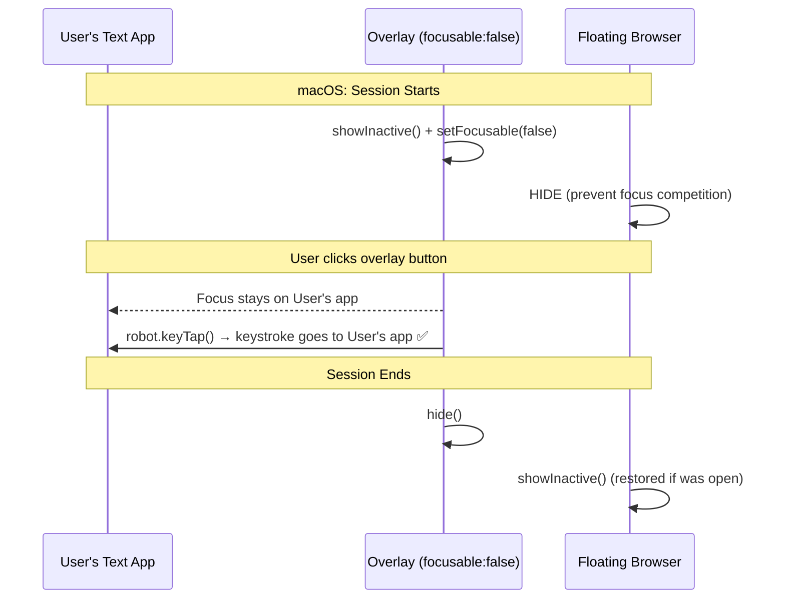

# macOS Overlay Focus Stealing Fix

## Problem
On macOS, clicking buttons on the floating overlay (punctuation, shortcuts, on-screen keyboard, emojis) would:
- **Defocus** the target text field
- **Beep** (macOS "invalid key" sound)
- Briefly **highlight the Edit menu** in the Electron app's menu bar
- Result in keystrokes going to Electron instead of the target app

## Root Cause
1. **macOS WindowServer** can reset the `focusable: false` / NSPanel non-activating flag during `setBounds`/`setSize`/`show`/`hide` cycles
2. The **floating browser window** (which is intentionally `focusable: true`) competed with the overlay in the macOS window stack, causing activation confusion
3. `setFocusable(false)` was only re-asserted on **Windows** after resizes, leaving macOS unprotected

## Changes Made

### 1. `src/main/window-manager.js`
render_diffs(file:///Users/sayedjohon/Documents/DEV_AREA/MicTab/mictab/src/main/window-manager.js)

**What:** 
- `applyOverlaySize()`: Now re-asserts `setFocusable(false)` + `setAlwaysOnTop('screen-saver')` on **both** platforms after every resize (was Windows-only)
- `createOverlay()`: Added `overlayWindow.on('show')` listener for macOS that re-asserts `focusable:false` + `alwaysOnTop` every time the overlay becomes visible

### 2. `src/main/floating-browser-manager.js`
render_diffs(file:///Users/sayedjohon/Documents/DEV_AREA/MicTab/mictab/src/main/floating-browser-manager.js)

**What:**
- `onOverlayShow()`: On macOS, **hides** the floating browser while the overlay is active (preventing the focusable browser from competing in the window stack). Windows behavior unchanged — browser shows alongside overlay.
- `onOverlayHide()`: On macOS, **restores** the floating browser via `showInactive()` if it was open before. On Windows, preserves the existing hide-on-overlay-close behavior.

### 3. `src/main/ipc-handlers.js`
render_diffs(file:///Users/sayedjohon/Documents/DEV_AREA/MicTab/mictab/src/main/ipc-handlers.js)

**What:**
- `set-mini-mode`: Changed `setFocusable(false)` from Windows-only to both platforms
- `set-dropdown-open`: After dropdown resize + shadow invalidation on macOS, also re-asserts `focusable:false` + `alwaysOnTop('screen-saver')`

### 4. `main.js`
render_diffs(file:///Users/sayedjohon/Documents/DEV_AREA/MicTab/mictab/main.js)

**What:**
- After `overlayWindow.showInactive()` + position setting, added explicit `setFocusable(false)` on macOS to catch any Chromium state reset from the show+position cycle

## How It Works Together

## Windows Impact
**None** — all macOS-specific changes are gated with `process.platform === 'darwin'` or use the existing cross-platform `setFocusable(false)` which was already correct on Windows.
